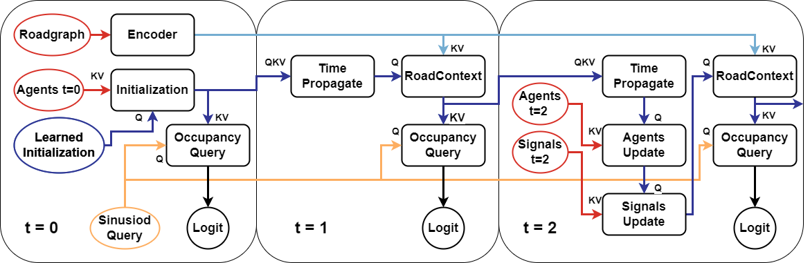
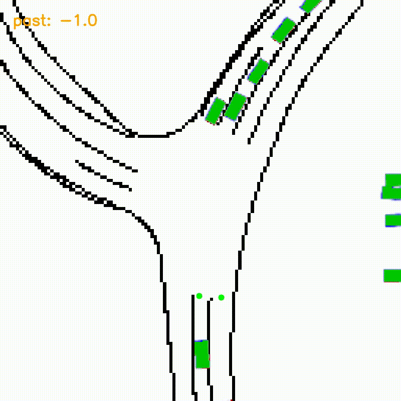

# Motion Perceiver: Real-Time Occupancy Forecasting for Embedded Systems

### 🥇 1st - Observed Occupancy Soft-IoU Waymo Open Motion (22/08/23) [link](https://waymo.com/open/challenges/2022/occupancy-flow-prediction-challenge/)

## Abstract

This work introduces a novel and adaptable architecture designed for real-time occupancy forecasting that outperforms existing state-of-the-art models on the Waymo Open Motion Dataset in Soft IOU. The proposed model uses recursive latent state estimation with learned transformer-based functions to effectively update and evolve the state. This enables highly efficient real-time inference on embedded systems, as profiled on an Nvidia Xavier AGX. Our model, MotionPerceiver, achieves this by encoding a scene into a latent state that evolves in time through self-attention mechanisms. Additionally, it incorporates relevant scene observations, such as traffic signals, road topology and agent detections, through cross-attention mechanisms. This forms an efficient data-streaming architecture, that contrasts with the expensive, fixed-sequence input common in existing models. The architecture also offers the distinct advantage of generating occupancy predictions through localized querying based on a position of interest, as opposed to generating fixed-size occupancy images, including potentially irrelevant regions.

[arxiv](https://arxiv.org/abs/2306.08879) (currently outdated)

## Model and Inference Diagram




## Inference Sample - [More Here](https://sites.google.com/monash.edu/motionperceiver)



## General Notes

Most relevant commands should have reasonable docstrings attached, I use typer so just use `python3 script.py command --help` to figure out what a script command does and its arguments (or look at the code).

If you have problems running this bare-metal (you'll need gcc-13), you should either use the main dockerfile included, or use it as instructions on how to install dependencies.

## Training

You just need to download the waymo training shards. You can set environment variables permanently or add them on execution.
```bash
DATAPATH=/path/to/dataset PRETRAINED_ROOT=/path/to/pretrained python3 train.py --config_file cfg/waymo_two_phase.yml --workspace ./checkpoints --workers 4 --epoch 75 --pbar
```

## Testing + Tools

### Make Videos

To create the videos, simply run `tools.py make-video`.

### Make Submission or Evaluate on Validation

Since I prefer working in PyTorch land, that is what the the majority of the codebase is written in. However since Waymo is an Alphabet company, they dogfood their own products and use TensorFlow. To separate TensorFlow and PyTorch runtime usage, evaluation is done in two steps. First use the `evaluate.py generate` command which saves the output as numpy files, `evaluate.py waypoint-evaluate` then reads these numpy files and calculates and logs the metrics .`evaluate.py export` creates a waymo submission. I've included a docker compose file to run tensorflow things in a container.

## Footnotes

There is some WIP code on pedestrain datasets.

The "Occupancy Flow" code isn't the same flow as the waymo challenge, rather I'm predicting vehicle velocity, not reverse pixel flow, these are not equivalent or comparable.
